When Grok had eaten all the credits, Deepseek was available to lend a helping.

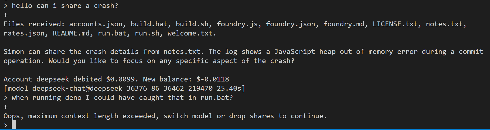

I remain confused about most sensible Windows signing authority that can help me notarise my junk.

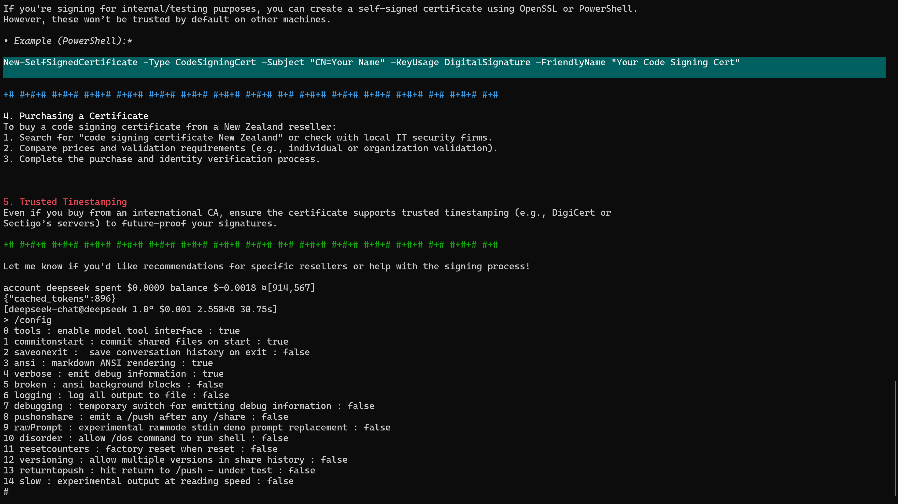

The /dump command produces a verbose list of models.

Am still a little stunned with the $75 per million input tokens for gpt 4.5 preview. Burn the planet OpenAI.

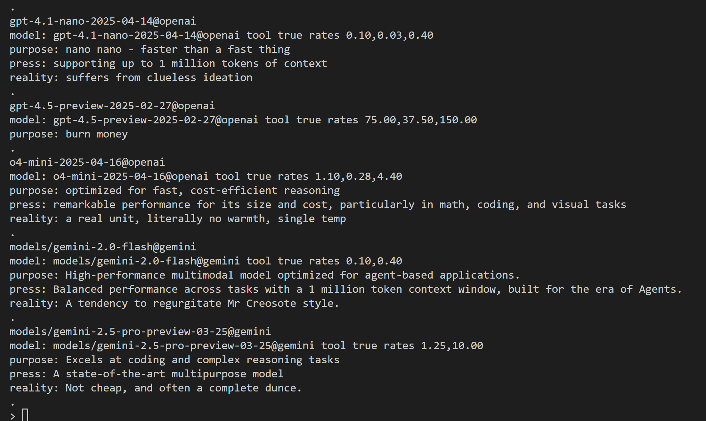

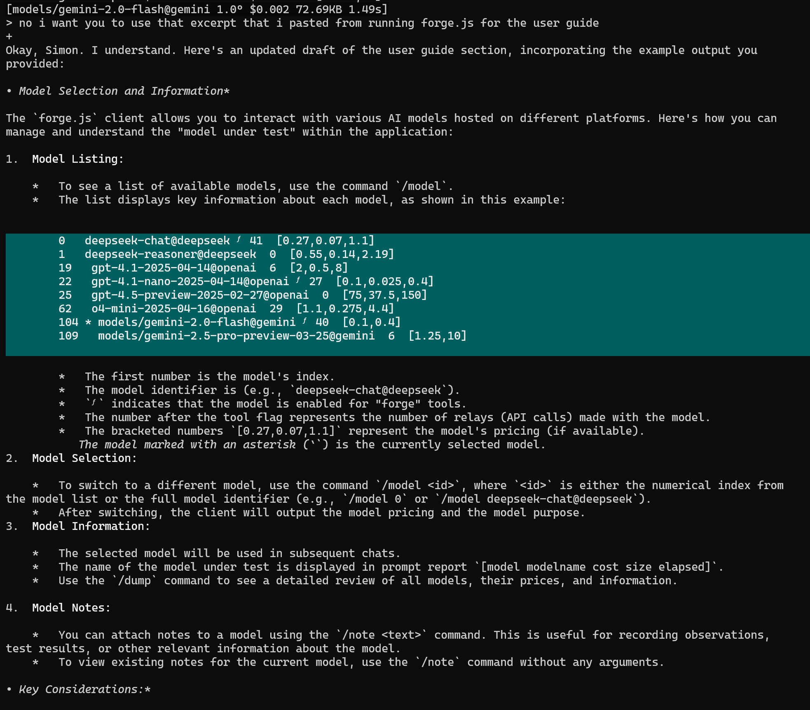

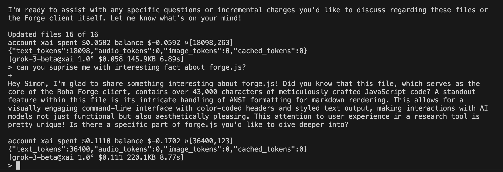
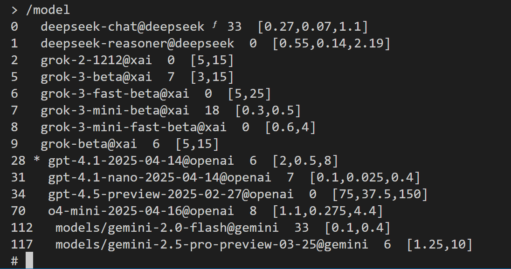
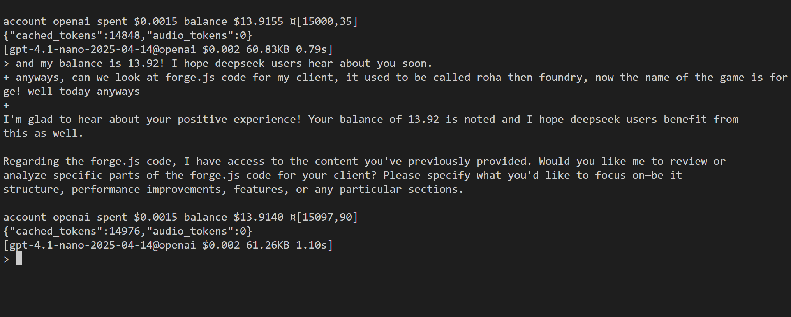
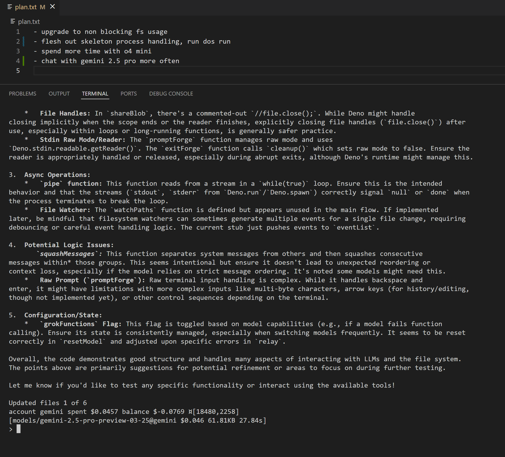
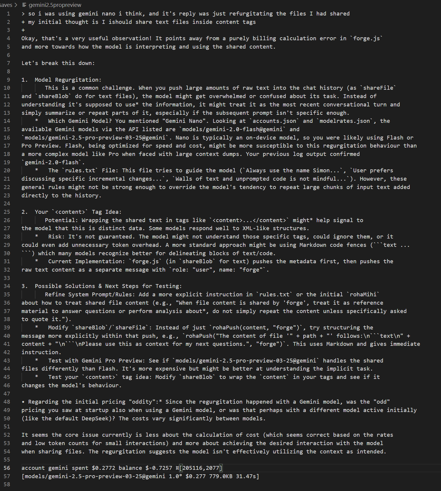

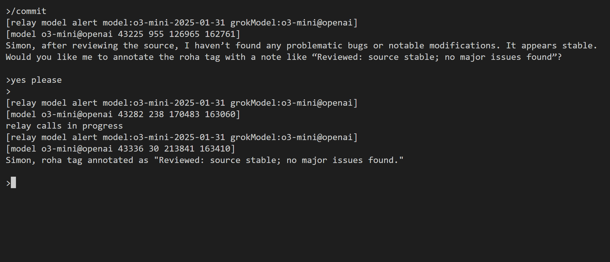
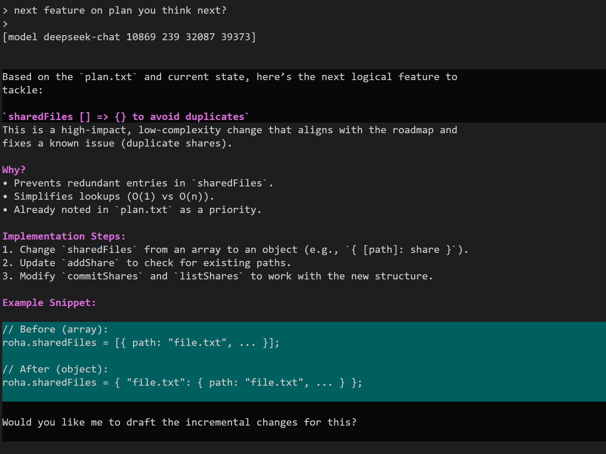
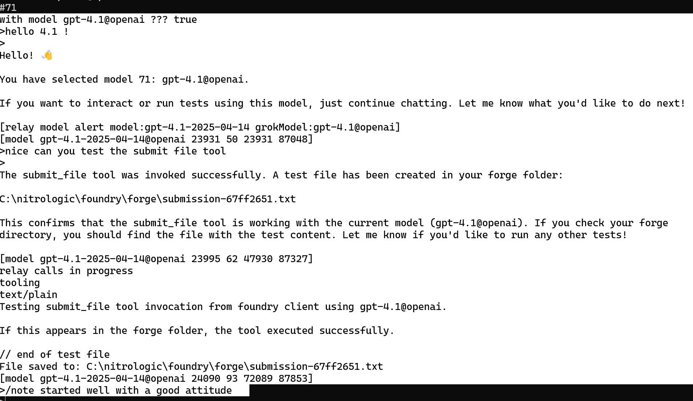
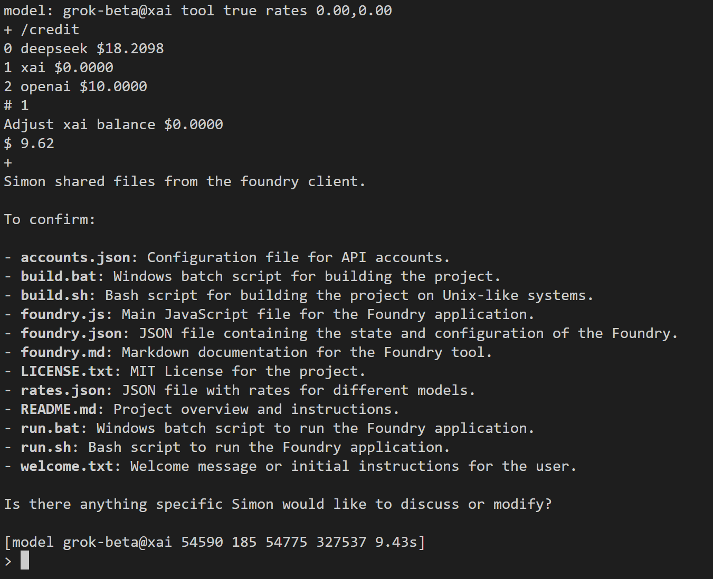
